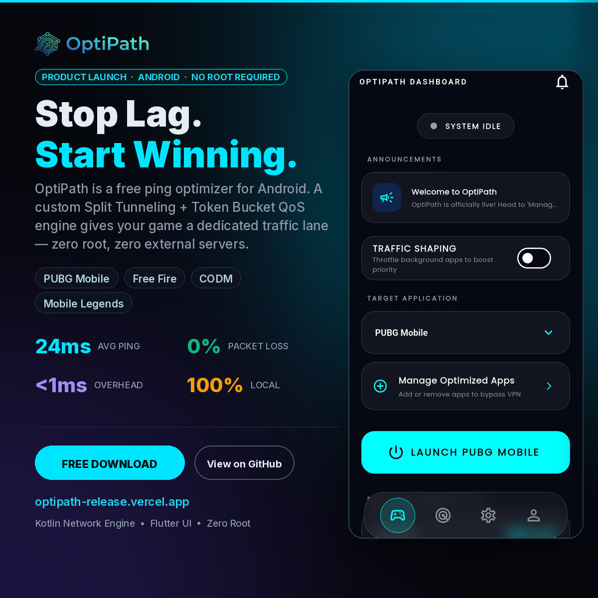

#  OptiPath: Local Network Optimization Engine

  

Official Website & Download Link: https://optipath-release.vercel.app

OptiPath is an Android-based local network optimization application designed to drastically reduce latency and ping spikes for competitive mobile gamers. 

Unlike traditional "gaming VPNs" that route traffic through remote servers, OptiPath operates entirely locally on the user's device. It eliminates local bandwidth contention by acting as a smart, on-device traffic controller.

## 🚀 Features
* **Zero-Overhead Gaming:** Utilizes Android's `addDisallowedApplication()` to exclude target games from the VPN tunnel, ensuring gaming packets hit the physical network directly.
* **Background Throttling:** Forces all non-gaming apps into a local `tun0` interface, where a custom Global Token Bucket algorithm artificially limits their bandwidth.
* **Live Network Diagnostics:** Real-time ping monitoring and Wi-Fi interference alerts (e.g., 2.4 GHz congestion warnings).
* **Offline-First Telemetry:** Uses SQLite for local session tracking, syncing with Firebase only when the network stabilizes.

## 📥 Download & Installation
1. Navigate to the [Releases](../../releases) page.
2. Download the latest `OptiPath-vX.X.X.apk` file from the Assets section.
3. Install the APK on your Android device (you may need to enable "Install from Unknown Sources").
4. Launch OptiPath, select your game, and start optimizing.

## 🏗️ Technical Architecture 
OptiPath is built using a layered modular architecture:
* **Frontend:** Flutter for cross-platform, responsive UI.
* **Network Engine:** Kotlin-native packet interception, custom IPv4 parsing, and Java NIO Selector-based UDP/TCP proxies.
* **Backend:** Firebase Authentication, Firestore, and Realtime Database (RTDB) for dynamic configurations.

## 🐛 Bug Reports & Feature Requests
Since the core engine is closed-source, this repository serves as the official hub for issue tracking and community feedback. 
If you encounter a bug or have a feature request, please [Open an Issue](../../issues).

---
*Note: OptiPath is proprietary software. The source code is closed, and this repository is maintained strictly for issue tracking and release distribution.*
